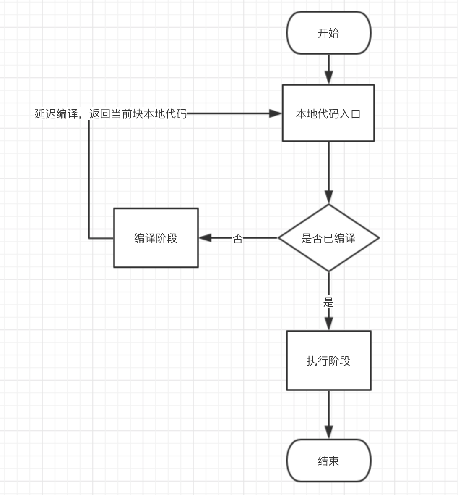

# javascript之js引擎的编译运行过程


**目录：**
 - [一、编译型语言与解释型语言](#一编译型语言与解释型语言)
    - [1、编译型语言](#1编译型语言)
    - [2、解释型语言](#2解释型语言)      
    - [3、编程语言本质没有类型的划分](#3编程语言本质没有类型的划分)   
 - [二、js编译步骤说明](#二js编译步骤说明)
    - [1、本地代码到抽象语法树（AST](#1本地代码到抽象语法树ast)
    - [2、JIT](#2jit)
    - [3、优化回滚](#3优化回滚)
 - [三、js解释运行原理](#三js解释运行原理)


## 一、编译型语言与解释型语言
### 1、编译型语言
编译型语言会先把代码编译为机器代码（一种二进制的机器指令集合，CPU可直接解读），再把机器代码放在服务上运行。

特性如下：

1、程序执行速度快，不依赖编译器：编译代码这一步发生在程序猿悠哉喝咖啡的本地环境中，将编译好的机器代码直接放在cpu上运行，所以编译的效率并不在关注范围内，同时运行的效率较高。

2、跨平台性差：由于操作系统的区别，编译型语言也存在弊端。比如跨平台的问题，在window下需要编译为ext文件，linux需要编译成erp文件。

根据以上的特性，开发操作系统、大型应用程序、数据库系统比较适合使用编译型语言。eg：c、c++。


```
graph LR
源代码-->抽象语法树
抽象语法树-->中间表示
中间表示-->本地代码
```
<html>
<p style="text-align: center;font-size:12px;color:#666;">图1.1.1 c++编译过程</p>
</html>

```
graph LR
本地代码-->执行
```
<html>
<p style="text-align: center;font-size:12px;color:#666;">图1.1.2 c++执行过程</p>
</html>


### 2、解释型语言
解释型语言，是代码运行时需要借助解释器，先将源代码或者中间语言（一种介于）解释为机器代码再运行。

特性如下：

1、程序执行效率低，依赖解释器：本地代码在运行时需要借助解释器先编译为机器代码再运行。


2、跨平台的优势：既然借助了解释器，也使得源代码更加的灵活。

根据以上特性，一些网页脚本、服务器脚本及辅助开发接口这样的对速度要求不高、对不同系统平台间的兼容性有一定要求的程序则通常使用解释性语言。eg：JavaScript、VBScript、Perl、Python、Ruby。

```
graph LR
源代码-->抽象语法树
抽象语法树-->解释器解释和执行
```
<html>
<p style="text-align: center;font-size:12px;color:#666;">图1.2.1 早期js解释执行过程</p>
</html>


### 3、编程语言本质没有类型的划分
随着时代的进步～设计思想的更新，编译型和解释型语言越来越笼统。有时候类型的划分也更多取决于应用场景。
比如java本质是解释型语言，但是作为后端语言其应用场景更趋向于编译型语言。它会在本地先编译为中间代码（.class文件），如图1.3.1。再将.class文件放在有java虚拟机的机器上进行解释运行，如图1.3.2。保证运行速度的同时也解决了跨平台的问题，但是前提是需要在服务器上安装java虚拟机。

```
graph LR
源代码-->抽象语法树
抽象语法树-->字节码
```

<html>
<p style="text-align: center;font-size:12px;color:#666;">
图1.3.1 java编译器编译
</p>
</html>

```
graph LR
字节码-->解释器
解释器-->即时编译-JIT
即时编译-JIT-->本地代码
```
<html>
<p style="text-align: center;font-size:12px;color:#666;">
图1.3.2 java虚拟机环境下执行
</p>
</html>


> 没错，这么说我们好像也可以使用编译器把js源代码在本地编译成机器语言当作编译型语言使用。但是可惜的是，js作为弱类型语言，只有在运行的时候才能知道其变量类型（内存的分配需要知道变量类型）。

## 二、js编译步骤说明
```
graph LR
源代码-->抽象语法树
抽象语法树-->即时编译-JIT
即时编译-JIT-->本地代码
```

<html>
<p style="text-align: center;font-size:12px;color:#666;">
图2.0.1 v8引擎解释运行过程
</p>
</html>

如图2.0.1 是现在主流浏览器使用的v8引擎的编译过程。以下说的js引擎均代表v8引擎。js作为解释型语言，解释与运行同步。先来看看解释的主要过程。

### 1、本地代码到抽象语法树（AST）
此过程包括词法分析与语法分析。词法分析生成静态作用域，再经过语法分析生成抽象语法树。作为前端ast经常听说，就是一个类似json的对象，链接：https://astexplorer.net/


### 2、JIT
即时编译（英语：Just-in-time compilation，缩写：JIT），是一种提高程序运行效率的方法。其本质是达到一边编译一边运行的效果而产生的方法。

js引擎使用c++编写了一些这样的类库，主要是为了提高编译的速度，让js编译的更快，于是它把编译分为编译和优化。

在编译阶段，它使用Fullcode类库，把ast粗略但是快速的编译为可执行本地代码。提升了编译速度就会牺牲了运行速度。于是就出现了优化阶段。

在优化阶段，我们首先需要知道触发优化的条件，js引擎使用Profiler类库（一个数据分析器）去记录函数调用的执行次数，速度和时间。当执行次数达到足够热时。Crankshaft编译出马了，它对足够热的代码进行优化编译，让它运行的更快。

这两种编译。对比如表2.2.1

- Fullcode编译：c++编写，可以将抽象语法树转变成本地代码并执行。

- Crankshaft编译：c++编写，将本地代码优化，进一步编译优化。

    * | fullcode编译| Crankshaft编译
    ---|---|---
    编译速度 | 快 | 慢
    优化程度 | 低 | 高
    触发条件 | 编译必触发 | 当一个函数执行次数足够热
    场景 | 主进程 | 反复调用的函数


<html>
<p style="text-align: center;font-size:12px;color:#666;">
表2.2.1 Fullcode编译与Crankshaft编译对比
</p>
</html>


### 3、优化回滚
优化回滚是优化编译Crankshaft编译对它做的错误决定回滚到之前的一种机制。
看以下这段代码：
```
function testFn(obj){
    return obj.prop + obj.prop;
}

var a = { prop: 'llwstr' }, 
    b = { prop: [] }, 
    i = 0;

while (i++ < 10000) { 
    // 执行函数达到足够热
    testFn(i !== 8000 ? a : b); // 参数类型变化，导致优化回滚
}
```

这段代码首先将testFn函数执行上千次，足够热后触发Crankshaft编译进行优化；优化的代码完美运行直到第8000次时，参数类型发生变化。这时发现错误，于是触发回滚，将优化后的代码回退到优化编译之前。

优化回滚是一个很耗性能的操作。所以我们在复用函数同时，不要改变函数的参数的类型。

#### 三、js执行过程

回到一开始的问题，解释型语言的本质是一边解释一边执行，js也同理。对于函数，他是在执行时才去触发编译，如果此函数未编译，则延迟编译。进入编译阶段，编译完毕后。再进入执行阶段。

如下图：




